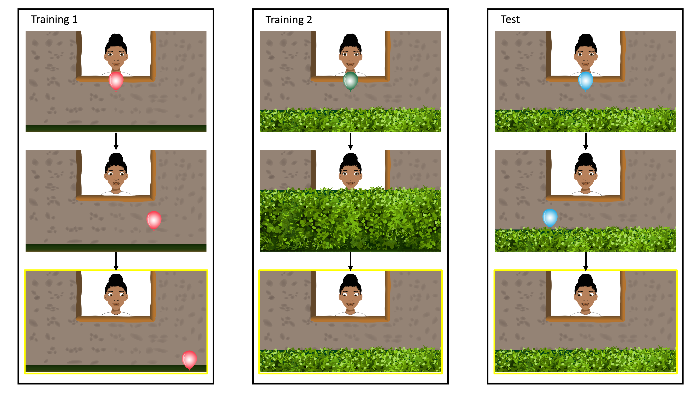
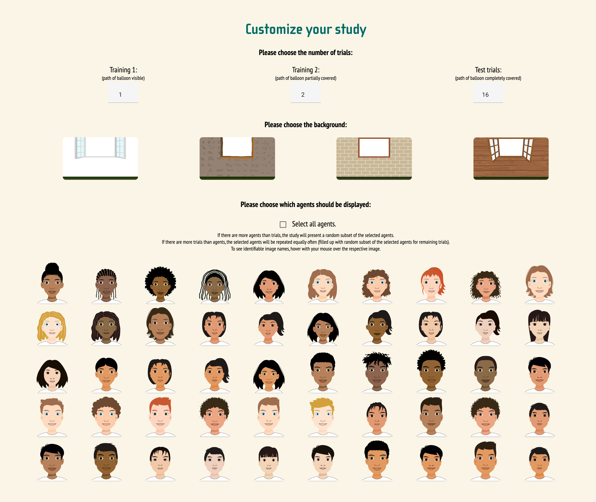

# Measuring variation in gaze following across communities, ages, and individuals — a showcase of the TANGO–CC

---

> Project repository with source code, data files and analysis scripts associated with the study.

---

## Paper

Prein J, Bednarski F, Dzabatou A, Frank M C, Henderson A M, Kalbitz J, Kanngiesser P, Keşşafoğlu D, Koymen B, Manrique-Hernandez M, Magazi S, Mújica-Manrique L, Ohlendorf J, Olaoba D, Pieters W, Pope-Caldwell S, Sen U, Slocombe K, Sparks R, Stengelin R, Sunderarajan J, Sutherland K, Tusiime F, Vieira W, Zhang Z, Zong Y, Haun D B, Bohn M. (2024). Measuring variation in gaze following across communities, ages, and individuals — a showcase of the TANGO–CC. _Advances in Methods and Practices in Psychological Science_.

### Abstract

Cross-cultural studies are crucial for investigating the cultural variability and universality of cognitive developmental processes. However, cross-cultural assessment tools in cognition across languages and communities are limited. This paper describes a gaze following task designed to measure basic social cognition across individuals, ages, and communities (TANGO-CC). The task was developed and psychometrically assessed in one cultural setting and, with input of local collaborators, adapted for cross-cultural data collection. Minimal language demands and the web-app implementation allow fast and easy contextual adaptations to each community. The TANGO-CC captures individual- and community-level variation and shows good internal consistency in a data set from 2.5- to 11-year-old children from 17 diverse communities. Within-community variation outweighed between-community variation. We provide an open-source website for researchers to customize and use the task (https://ccp-odc.eva.mpg.de/tango-cc). The TANGO-CC can be used to assess basic social cognition in diverse communities and provides a roadmap for researching community-level and individual-level differences across cultures.

## Repository structure

```
.
├── data                                    <-- data files
|   ├── data.csv                            <-- data that we analyzed in the paper
|   ├── example_data_osf.csv                <-- example how data should look like for uploading it to shared OSF data set
|   └── README_DATA.md                      <-- further explanation of the data variables
├── figures                                 <-- plots presented in the paper
├── paper                                   <-- manuscript files (written in Rmd, rendered as docx and PDF)
├── saves                                   <-- saved output from stats analyses
├── stats
|   └── analysis.Rmd                        <-- code to run analyses reported in the paper
└── supplements                             <-- supplements file (written in Rmd, rendered as PDF)
```

## TANGO-CC

The task can be accessed under the following link: https://ccp-odc.eva.mpg.de/tango-cc/.

For detailed instructions, see the TANGO-CC’s manual: https://ccp-odc.eva.mpg.de/tango-cc/manual.html



Figure 1. **Screenshots of the trials.** In training 1, an agent looks at a balloon that falls to the ground, and participants have to respond by clicking/touching the balloon. In training 2, the balloon falls behind the hedge while its flight is still visible. Participants respond by clicking the hedge where they think the balloon is. In test trials, the balloon’s movement and final position are covered by a hedge, and participants respond by clicking the hedge. In the task, all movements are smoothly animated (no still pictures). Yellow frames indicate the time point when participants respond (only illustrative, not shown during the task).



Figure 2. **Screenshot of the customizable components of the TANGO-CC.** Researchers can select the lan- guage of the audio instructions (see Table 1), the number of trials per trial type, the background, and the agent’s face.
