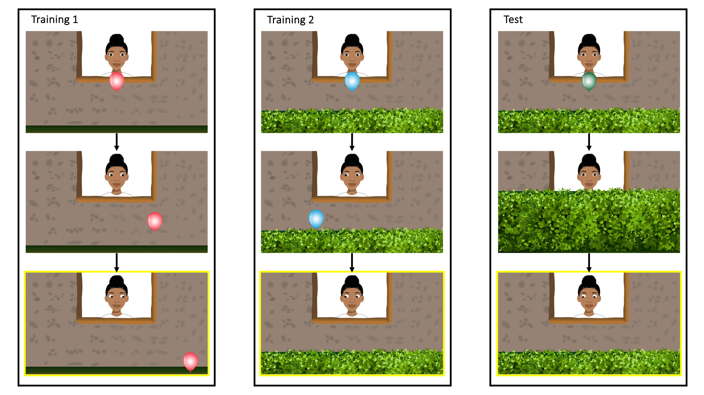

```{r setup, include = FALSE}
library("tidyverse")
library("papaja")
library("kableExtra")
library("brms")
library("janitor")

theme_set(theme_classic())
```

```{r analysis_preferences}
# Seed for random number generation
set.seed(42)
knitr::opts_chunk$set(cache.extra = knitr::rand_seed)
```

# Introduction

More than a decade ago, @henrich2010weirdesta advocated for more diverse samples in psychological research and cautioned against relying solely on participants from Western, Educated, Industrialized, Rich, and Democratic (WEIRD) backgrounds. Despite numerous calls for change, the subject pools reported in high-impact journals still lack diversity [@nielsen2017persistent]. This lack of representation creates inequities and hampers progress in theory building: If we want to draw inferences about the unique characteristics of human behavior and "human nature", we need to study it in many humans from many different backgrounds [@krys2024weirda].

The present sampling bias might be especially problematic in research concerning the development of social cognition. Social cognition concerns the processes by which individuals encode and decode social information [@glynn2016social], which allows them to successfully participate in joint activities and communication. Many developmental theories emphasize the role of social interaction in the development of social cognition (e.g., reinforcement learning in gaze following; [@jasso2006using]). However, social interactions differ substantially in their characteristics across communities and even across families and individuals. Cultural and social experiences influence the beliefs, values, norms and expectations of an individual, which, in turn, determines how they interpret other's actions. Consequently, @selcuk2023development have urged for studying how social-cultural factors on a macro-, community-level as well as a micro-, family-level influence the social cognition development. 

Why are there not more social-cognitive studies focusing on the variation between diverse communities and individuals? A potential reason for the under-representation of these studies may be the scarcity of suitable tools [@bourdage2023evaluation]. A suitable tool for studying individual- and community-level variation needs to address its (1) psychometric properties and (2) cross-cultural adaptations.

First, studies investigating variation between communities and/or individuals need to ensure that the captured variation is systematic and not just random noise. This requires measurement reliability and validity. Yet, social cognition studies based on US-American and European samples rarely report psychometric information [for a review, see @beaudoin2020systematic]. This picture further deteriorates when we pay attention to the reliability and validity of cross-cultural social cognition tasks [@hajduk2020how; @bourdage2023evaluation]. It remains challenging to find reliable and valid tasks that can capture individual differences within one community, let alone finding tasks that can be applied across different cultural settings.

Second, adapting tasks to diverse cultural settings and re-assessing their validity and reliability might be especially important in the social-cognitive domain. If, in theory, stimuli used in social cognition tasks should depict people's everyday experiences, the tasks need to represent different social and cultural environments. Indeed, task performance can be diminished when stimuli are not adjusted [@pena2007lost]. For example, @elfenbein2002universality found better emotion recognition for members of the same national, ethnic, or regional group. @selcuk2023development concluded that children often attribute mental states more accurately and more frequently to individuals from the same cultural group. This underlines the importance of adapting tasks to each specific cultural context.

Broadly speaking, there are two different approaches that researchers can take to collect data that is comparable across cultural settings. One approach would be to translate the psychological construct into an individually designed study for each cultural setting. While this approach is most flexible and sensitive to cultural differences, it might be most feasible for studying up to a handful communities. Examples for studies that followed this approach are @mehta2011validation, @stengelin2020cultural, @chasiotis2006theory. However, recent articles call for the inclusion of more field sites in cross-cultural studies [e.g., @krys2024weirda]. The approach of individually re-designing a study for each community might then become too demanding and time-consuming. Another approach would be to use the same standardized procedure across diverse cultural settings. This approach is less sensitive to each community's unique characteristics but allows for a direct comparison of data across cultural settings. Examples following this approach include @callaghan2011early, @taumoepeau2019crosscultural, @hughes2018does, @hughes2014lost, @fujita2022theory. This paper aims to describe the development and psychometric properties of a standardized task that can be adapted to different social and linguistic settings. 

The task presented in this manuscript focuses on gaze following, the ability to identify the attentional focus of another agent. Gaze following develops early in infancy [@delbianco2019developmental; @tang2024slow] and contributes to social learning, communication and collaboration [@shepherd2010following; @tomasello2007reliance; @bohn2018common; @hernik2019infant]. While gaze following acts as one of the most fundamental social-cognitive abilities, studies focusing on cultural variations are rare. The few existing results are mixed whether gaze following is influenced by cultural factors or not [@hernik2019infant; @callaghan2011early].

The task presented here builds upon the TANGO (Task for Assessing iNdividual differences in gaze understanding - Open) by @prein2023tango. The TANGO measures participants' imprecision of locating an agent's attentional focus. It has been shown to reliably capture individual differences in a German child sample and an international remote adult sample. The task was sensitive to developmental changes and linked to children's receptive vocabulary. Furthermore, an exploratory analysis showed that children performed equally well in a study version with animal faces compared to cartoon human faces [@prein2023variation]. Therefore, superficial variations in the stimulus design do not seem to influence children's performance in the task.

This paper showcases the TANGO-CC (TANGO - Cross Cultural), a standardized gaze-following task that can be adapted to several languages and cultural settings. We describe our reasoning behind the task's development and provide a tutorial for the open-source website (<https://ccp-odc.eva.mpg.de/tango-cc/>). We present results from a large cross-cultural sample of 2.5- to 11-year-olds from 17 different urban/rural communities across the world and discuss the task's psychometrics. The task and all its adaptations have been initially designed for a paper by @bohn2024universal, and we re-use the data set in this paper.

# Task development

## Approach 

In a perfect world, developing a cross-cultural task would include international collaboration and diverse samples from the beginning, already during piloting and item selection. As this seems hardly feasible, we present an alternative, pragmatic approach to developing a task that can be applied across different communities. This approach has its faults. However, we later present results that show that our task adaptation yielded stable, clear results across a wide range of communities.

Our general approach to developing the TANGO-CC consisted of two main parts. First, the task was implemented in one context, in our case with a German sample (the TANGO; [@prein2023tango]). In this context, we assessed the task's reliability and validity in detail. Even though this does not guarantee that the task will work in another context, we believe it increases the chances. Second, we collaborated with cross-cultural researchers and expanded the stimulus pool to diverse cultural and linguistic settings. @bohn2024universal collected data in 17 communities worldwide. We assessed performance across trial types and checked for individual differences. If we found individual differences in other communities to a similar degree to the German sample, it was likely that these individual differences were also systematic. This would be, for example, less likely if we saw floor- or ceiling effects. Reliability was estimated using internal consistency measures. Therefore, our procedure tried to maintain a balance between a detailed analysis of the task's psychometric properties across communities and a swift and feasible task adaptation. In the following, we describe the different steps in further detail. Even though we focus on the cross-cultural adaptation of the TANGO, we believe the general approach might be helpful for other researchers who aim to design cross-culturally adaptable tasks.

In the first step, we designed the task's underlying functionality. We aimed for a measure that maps directly onto the task's underlying psychological construct: in our case, the imprecision with which participants can locate an agent's attentional focus. We were motivated to create a continuous outcome measure since this allows for more room to capture individual differences. The core of the task was calculating where the agent's eyes must move to follow the target's movement. In the next step, this structure was filled with the task's superficial appearance and audio instructions. Notably, the task's presentation can be adjusted without changing its underlying structure. For example, we can change the background scene, the faces of the agent, and the target without changing the logic of where the agent looks or the participants' task to identify an agent's attentional focus. We realized that as soon as the task's underlying structure was implemented, adaptations of the task and data collection efforts were greatly simplified.

After implementing the task, we assessed the psychometric properties of the TANGO in a WEIRD sample. We collected data of a German child sample and an international remote adult sample [@prein2023tango]. The adult sample worked as a proof-of-concept and showed that remote data collection worked very well. We reasoned that if we find individual differences in an adult sample, chances are high that we also find them in a child sample, as adults usually exhibit less variation in abilities than children. The task captured a developmental change and showed neither floor nor ceiling effects.

Most importantly, we found individual differences across all age groups. By evaluating split half- and retest reliability estimates, we could show that the individual variation was systematic and not just random noise. Additionally, we assessed the task's validity by examining the relationship with theoretically related concepts. Performance in the TANGO was linked to children's receptive vocabulary and weakly related to factors of children's daily social environment [@prein2023tango]. In another study, we proposed a computational cognitive model that described gaze following as a social form of vector following. Gaze following, as measured by the TANGO, was related to children's vector following and visual perspective-taking abilities [@prein2023variation]. These connections to related constructs speak toward the task's validity in the German setting. An exploratory analysis showed that performance in the TANGO was similar when presenting animal vs. human faces [@prein2023variation supplements]. This demonstrates that the participants' performance did not depend on superficial features of the task's appearance.

As a next step, we contacted cross-cultural researchers and field assistants interested in using the TANGO. We asked local people to give input as to how we could adapt the task to their local needs. Together with their help, we generated a set of 50 diverse human faces that were aimed to be representative of each local population. Similarly, different backgrounds were created that roughly represented a typical accommodation in each community. Research assistants translated the audio instructions into the corresponding local language. By back-translating these instructions, we ensured the original meaning did not change. Sometimes, specific words were linguistically slightly modified, although functionally equivalent (e.g., "bush" instead of "hedge") to ensure that all participants understood the instructions. Before collecting data in each community, we piloted with a small sample. This procedure slightly varied between communities; see supplements for further details. In the following, we describe the design features of the TANGO-CC in greater detail. 

## Features of the TANGO

The task presented in this manuscript is the cross-cultural adaptation of the TANGO [@prein2023tango]. We quickly recap the TANGO's most characteristic features: Participants are asked to locate a balloon with the help of a gaze cue. The outcome variable is the distance between the participant's touch and the balloon's center. Trials can be completed in a fast and efficient way, so that children can easily complete 15 trials within 10 min. This drastically reduced drop-out rates. By using essentially self-explanatory animations, language demands are kept to a minimum. To keep trials comparable and avoid learning effects, no differential feedback is given.

### Task implementation

The task was implemented in `JavaScript`, `HTML`, and `CSS`, and is presented as a web app. It can be accessed on any web browser and does not require prior installation. The online version of the task has been proven convenient for unsupervised data collection (for example, using participant recruitment services like *Prolific*, see @prein2023tango), and sharing the task across big international collaborations. Importantly, the web app implementation does not necessarily need a working WIFI connection: An offline, local version of the task can be quickly set up for devices that support Node.js (<https://nodejs.org/en>). This is an especially useful feature for researchers working in remote areas with limited internet access.

The stimuli are embedded as Scalable Vector Graphics (SVG). The setup allows for an easy adaptation of study elements and ensures that picture quality, aspect ratio and relative object positioning are constant. We implemented some features designed to ensure meaningful clicking responses. The study is programmed so that responses are only registered when the participant touches the relevant part of the screen (i.e., in test trials the hedge). Furthermore, clicks are only registered after the voice recordings stopped playing. If no click is registered within 5 seconds, an audio reminder is played again.

The website does not use cookies, nor does it upload any data to servers; that is, the data is only stored locally on the device. The output of the study is a CSV file that contains the participants' responses and can be easily imported into statistical software for further analysis. The saved variables are: id, language, background, trial_number, study_phase, audio_instructions, keep_trial, agent, balloon_color, balloon_bin, balloon_center, click, absolute_click_distance, timestamp, responsetime_ms. In case a webcam recording was selected, a second file is saved that contains the webcam recording (WEBM file). The files will be stored in the device's downloads folder and is named after the following pattern: "tangoCC-participantID-YYYY-MM-DD_hh_mm_ss".

### Trial types

The task consists of three different trial types. In every trial, participants see an agent (boy or girl) looking out of house, with a balloon (red, blue, green or yellow) in front of them. The balloon falls down to the ground, while the eyes of the agent follow the movement of the balloon in a way that their centers always align. Depending on the trial type, participants have different visual access to the balloon's position.
In training 1, participants see the full trajectory of the balloon and directly have to touch the balloon itself. In training 2, participants see most of the balloon's movement but the final location is covered by a hedge. In test trials, a hedge grows in the beginning of the trial and participants see neither the movement nor the final position of the balloon. The first trial of each type contains an audio description of the presented events (see Supplements). Importantly, the instructions explicitly state that the agent is looking at the balloon.

### Randomization

The order of the agents, balloon colors (red, yellow, green, blue), and balloon positions are each randomized independently. For the balloon positions, the full width of the screen (1920 in "SVG unit") is divided into ten bins. Exact coordinates (value between 0 far left and 1920 far right) within each bin are then randomly generated. The number of repetitions for each agent, balloon color, and balloon bin is calculated based on the total number of trials and the number of unique agents, balloon colors, and bins, respectively. All agents, balloon colors, and bins appear equally often and are not repeated in more than two consecutive trials. If the total number of trials is not divisible by the number of unique elements, additional elements are randomly selected to make up for the remainder.

## Cross-cultural customization

The TANGO-CC expands the stimulus pool of the TANGO by depicting human faces and different languages for the audio instructions. The TANGO-CC can be accessed here: (<https://ccp-odc.eva.mpg.de/tango-cc/>). Researchers can customize the following parts of the task. In the first step, researchers can enter an alphanumeric participant identifier (1 - 8 characters). Audio instructions are currently available in 13 different languages (and even more dialects): Bayaka (Rep. Congo), Bemba (Zambia), Chinese (China), English (India), English (New Zealand), English (Nigeria), English (UK), English (USA), German (Germany), Hai||om (Namibia), Khewdam (Namibia), Lingala (Rep. Congo), Marathi (India), Shona (Zimbabwe), Spanish (Argentina), Spanish (Mexico), Swahili (Uganda), Turkish (Türkiye). Please note that the written instructions are always in English, however, children are not required to understand them (directed to the research assistants). A webcam recording of the participant can be enabled to record the participant's behavior during the task. Please ensure appropriate data protection measures are in place before enabling this feature. The study can either be started with default settings (depending on the chosen language: the stimuli which have been used by our reported samples here will be shown), or further customized. 

If researchers choose to further customize, the number of trials can be chosen for each trial type. No trial type can be skipped, so the minimum number of trials per type equals 1, the maximum equals 100. As the trial types build up on each other, each trial type is necessary to understand the structure of the task and needs to be completed before the next trial type starts. One out of four different backgrounds can be picked. Finally, there are 50 diverse human faces (50% female, 50% male) from which researchers can choose. There is no constraint on how many faces are allowed (min 1, max 50). Once all the settings are adjusted, the task can be started.

We have compiled an instruction manual with the most frequently asked questions (<https://ccp-odc.eva.mpg.de/tango-cc/manual.html>). The source-code of the task is available on GitHub (<https://github.com/ccp-eva/tango-cc>). By edited the `HTML` and `JavaScript` code directly, researchers gain even more flexibility in adjusting the task to their needs.

(ref:figlab1) **Customizable components of the TANGO-CC.** Researchers can select the language of the audio instructions, the number of trials per trial type, the background, and the agent's face. Screenshots of the trial show the proceeding events: in Training 1, an agent looks at a balloon that falls to the ground and participants have to respond by touching the balloon. In Training 2, the balloon falls behind the hedge, while its flight is still visible. Participants respond by touching the hedge where they think the balloon is. In Test trials, the balloon's movement and final position are covered by a hedge and participants respond by touching the hedge. In the task, all movements are smoothly animated (no still pictures). Yellow frames indicate the timepoint when participants respond (only illustrative, not shown during the task).

```{r fig1, include = T, out.width = "100%", fig.align = "center", fig.cap = "(ref:figlab1)"}

```

# Data collection

## Participants

```{r sample_table}
sample_table <- readRDS("../saves/sample_table.rds")
```

The here used data set has been published by @bohn2024universal. The sample includes *N* = `r sample_table[sample_table$Community == "Total",]$Total` children between 2.5 to 11 years of age. Participants come from 17 communities in rural and urban settings on five continents with varying degrees of market integration and technology exposure.

## Procedure

We collected data using offline and online versions of the TANGO-CC on a Windows tablet. A local research assistant guided the children through the study. We instructed the research assistants to motivate the children and guide their attention to the screen, while explicit feedback (e.g., praise for a precise click) and hints (e.g., "look at the eyes") were not allowed.

## Analysis

As a first feasibility check, we inspected the mean and standard deviations by community and compared performance in each trial type (training 1, training 2, test trials). Since the age distribution across communities varied slightly, test trials were further analysed by performing a model-based age correction. A Generalized Linear Mixed Model (GLMM) was fitted with the mean imprecision as the outcome, age as a predictor and participant id as random effects: `imprecision ~ age + (1 | subjid)`. Furthermore, the within- and between-community variance and the intraclass correlation (ICC) were calculated. 

To assess reliability, we estimated internal consistency in each community in three different ways. First, data of each participant was split into odd and even trials and a Pearson correlation was calculated between the aggregated scores of the two halves. Second, using the function `by_split` from the `splithalfr` package [@pronk2022methods], data was stratified by target centrality, and a Pearson correlation was calculated between the matched halves. Third, an age correction was performed for the stratified approach by fitting a GLMM with the mean imprecision as the outcome, age as a predictor, and test half and participant id as random effects: `imprecision ~ age + (0 + half | subjid)`. This process was repeated 50 times for each community. The posterior estimate of the correlation between the two person-specific estimates is taken as the age-independent estimate for internal consistency. 

# Results

```{r read_results}
var_df <- readRDS("../saves/var_df.rds")
within_person <- readRDS("../saves/within_person.rds")
# range(var_df$within_community_variance)
# var_df$community[which.min(var_df$within_community_variance)]
# var_df$community[which.max(var_df$within_community_variance)]
```

(ref:figlab2) **Measurement of the TANGO-CC by community and trial type.** (A) Mean imprecision in locating the agent's attentional focus by community (alphabetically) and trial type. Imprecision is defined as the distance between the participant's touch and the balloon's center, in units of balloon width. For a depiction of each trial's procedure, see Figure 1. (B) Age-corrected imprecision in test trials by community. White lines (|) show the person-specific model predictions. (C) Internal consistency estimates by community, following three different approaches. In the odd-even split, the size of points reflects the sample size in each community. 

```{r fig2, include = T, out.width = "100%", fig.align = "center", fig.cap = "(ref:figlab2)"}
knitr::include_graphics("../figures/tango-cc-results.png")
```

Across communities, children performed best in training 1, followed by training 2 and test trials (see Figure \@ref(fig:fig2)A). The almost perfect performance in training trials indicated that children understood the task and were able to locate the balloon. In test trials, children's imprecision was higher, indicating that the task was more challenging. The TANGO-CC captured individual differences across ages and communities. A model-based age correction (see Figure \@ref(fig:fig2)B) provided evidence that the variation between individuals existed beyond the effect of age. All communities showed great individual variation and overlapped massively in their imprecision levels. 

The variation of children within one community was greater than the variation between the communities. The mean within-community variance was `r mean(var_df$within_community_var)`, ranging from `r min(var_df$within_community_var)` (in Pune, India) to `r max(var_df$within_community_var)` (in Chimfunshi, Zambia). Between-community variance was `r var_df$between_community_var[1]`. The intraclass correlation (ICC), representing the proportion of between-community variance relative to the total variance (sum of within- and between-community variance) was `r var_df$ICC_b[1]`.

To see whether these differences were reliable, we assessed the task's internal consistency. The results from a simple odd-even split and the split half-reliability stratified by target centrality with and without model-based age correction yielded comparable results and are shown in Figure \@ref(fig:fig2)C. Across all communities, the task showed satisfactory to high reliability, with estimates ranging roughly between 0.5 and 0.9 (Plymouth, UK, being an outlier in the stratified, age-corrected internal consistency). In an exploratory analysis, we found that communities with larger individual variation showed higher internal consistency estimates. Please note that this could be influenced by outliers and that the sample size here (*N* = 17 communities) is too small to make substantial claims. 

As data collection across communities was organized slightly differently, we cannot report drop-out rates by community.

# Discussion

We have presented a new task, the TANGO-CC, that measures imprecision in gaze following across individuals, ages, and communities. The task development took place in two main phases. First, we implemented the task's underlying functionality in one community and established validity and reliability in this setting (Leipzig, Germany). In the next step, we collaborated with cross-cultural researchers to create a larger stimulus pool. In this paper, we presented data from 17 different communities across the world and discussed the TANGO-CC's psychometrics. Children's imprecision in gaze-following highly overlapped between communities: children performed similarly in training and test trials, and within-community variation greatly exceeded between-community variation. The task showed satisfactory to high reliability across all communities. Therefore, we believe the TANGO-CC is a promising tool to capture individual differences in social-cognitive development in diverse social-cultural environments.

A similar approach to task development was followed by @mehta2011validation. The researchers (1) selected social cognition measures that have been established in other settings, (2) adapted the agent's names, appearance, backgrounds, and languages to the local context, and (3) assessed the task's validity and internal consistency in the new setting. Their approach yielded a successful adaptation of social cognition measures for Indian (Hindi/Kannada) communities. Yet, @bourdage2023evaluation have argued that adapting social cognition tasks to each individual community is infeasible: the number of world cultures is vast, and communities are constantly changing. A promising approach, as taken by the TANGO-CC, might be to provide tasks with a modular building block system where components can be exchanged according to the local context.

The biggest strength of the TANGO-CC is its flexibility: researchers can choose from different agents, languages, trial numbers and background scenes (see Figure \@ref(fig:fig1)). The task is presented as a web app, which can also run offline to enable remote data collection. Minimal language demands and an engaging, playful design increase the task's comprehensibility. Together with a short study duration, this reduces drop-out rates and enables efficient data collection with large sample sizes. The TANGO-CC follows a standardized procedure and uses a continuous, objective outcome measure (leaving no room for rater errors). An online manual with the most frequently asked questions is available at https://ccp-odc.eva.mpg.de/tango-cc/manual.html. Even more customization can be achieved by adding new stimuli to the open-source code available on GitHub (https://github.com/ccp-eva/tango-cc). 

Since years, researchers haved called for more diverse sampling and culturally valid social cognition measures [e.g., @mehta2011validation; @nielsen2017persistent; @matsumoto2006new]. As @hajduk2020how put it, "using large samples and multisite approaches will align with efforts to improve reproducibility and will clarify both the type and extent of cultural influences on social cognition" (p. 463). The TANGO-CC takes a valuable step in this direction by including large sample sizes from diverse communities and sharing both the data set and the task itself with other researchers. In this manuscript, we could show that data collection with the TANGO-CC was feasible in 17 diverse communities in rural and urban settings with varying degrees of market integration and technology exposure. While we cannot generalize our findings to all communities worldwide, we found that it worked well in the 17 communities that took part in this study. However, we do not want to signal that cross-cultural research is easy or that data can be collected remotely without a lot of effort. We want to emphasize that using the TANGO-CC in a new community, of course, needs sensitivity to the specific context, piloting, and, most importantly, input from local collaborators. We hope that the TANGO-CC will facilitate future cross-cultural studies to assess social-cognitive development in a wide range of communities.

A valid question is whether the TANGO-CC measures the same construct across different groups. This so-called measurement invariance is often seen as a requirement for a "fair" cross-cultural comparison and relies on minimizing group differences, while individual differences are magnified. As @kusano2024mismeasure put it: "The research challenge is to achieve a balance between ensuring methodological “fairness” at the individual level while also recognizing and capturing genuine sociocultural variability" (p. 34). We argue that the TANGO-CC measures a fundamental social-cognitive ability that is likely similar across cultural groups. This is also represented in our results, as we found that the within-group variability was greater than the between-group variability. Similarly, @selcuk2023development pointed out that researchers should study both the within- and the between-culture variability in the development of social cognition since sometimes within-culture differences are more influential. While we do believe that the TANGO-CC can be used to compare mean differences across cultural settings, we would recommend focusing on linking individual differences to social-cognitive or environmental factors.

# Limitations

The TANGO-CC and its psychometric properties need to be considered against some limitations. Reliability for each community was assessed by calculating the internal consistency. Ideally, we would have additionally assessed the task's retest reliability by cultural setting and checked for relationships with theoretically related constructs.

@schilbach2013secondperson pointed out that witnessing social interactions as an observer undoubtedly differs from actively participating in social interactions. This argument touches on two different points: (1) the mode of stimulus presentation (i.e., online vs. offline/real-life) and (2) the role of the participant (i.e., active vs. passive). First, potentially, not all children perceive the tablet-based presentation of the TANGO-CC as depicting a social interaction. In a German sample, we found that performance in the TANGO was linked to children's visual perspective-taking abilities in real-life social interaction [@prein2023variation]. Arguably, children in this sample recognized the social context of the task. However, this could vary between communities: Children with prior TV or computer game exposure might be more inclined to interpret the cartoon-like faces as social stimuli. Indeed, @bohn2024universal have shown that children with no prior touchscreen exposure were slightly less precise in the TANGO-CC than children with prior experience. Notably, while this caused absolute differences in task performance, all communities showed the same processing signature: more precise responses for more central target locations. Furthermore, individual differences were also found in communities with 100% touch screen exposure, showing that this factor alone could not explain children's performance in the task [@bohn2024universal]. In this manuscript, we could additionally show that internal consistency was high across all communities. Nevertheless, the mode of stimulus presentation surely needs to be kept in mind when administering the TANGO-CC, especially in communities with little technology exposure. Additional touch screen training (e.g., more trials of training 1) might prove helpful in these cases.

Second, participants in the TANGO-CC observe another agent's gaze. While we employ an active choice measure and ask participants to use the agent's gaze to guide their behavior, children do not take part in a turn-taking social interaction. Future research could investigate whether a prior social interaction, for example, trials in which the child determines where the agent should look, could increase children's performance in the task. 

The target object presented in the TANGO-CC might be more common in some communities than in others. While we cannot rule out that this influenced children's performance, the huge overlap in performance across communities speaks for a generalizable underlying construct. In test trials, the target object is only visible for a very short amount of time, and the identity of the object is not relevant for succeeding in the task. Nevertheless, future research could investigate the effects of presenting different target objects. For example, @pena2007lost has proposed a decentering approach, where items are individually adapted to be culturally familiar in each setting. The same applies to the agent's face: while we tried to create a diverse set of faces, the faces might be more representative of some communities than others. The component-like structure and the open-source implementation with SVGs allow researchers to exchange stimuli according to their needs. 

@krys2024weirda have recently categorized countries into "macrocultural groupings: (1) WEIRD, (2) Confucian-influenced, (3) Latin America and Caribbean, (4) Middle East and North Africa (excluding Israel), (5) non-Confucian Asia and Oceania, (6) sub-Saharan Africa, and (7) non-EU postcommunist states" (p. 5) and proposed that cross-cultural studies should aim to include at least one country from each macrocultural grouping. Although we included communities from five continents, we did not follow this categorization and indeed did not collect data in "non-EU postcommunist states" (e.g., Russia, Georgia, Serbia; even though it might be questioned whether this label is well-chosen). While the results from the TANGO-CC seem promising, we cannot generalize them to all communities worldwide.

# Conclusion

The TANGO-CC is a promising tool to capture individual differences in social-cognitive development across diverse social-cultural environments. Task development occurred in two phases: (1) establishing the task's underlying functionality and detailed psychometrics in one community, and (2) expanding the stimulus pool and collecting data from diverse communities world-wide. The task's flexibility, minimal language demands, and engaging design make it a valuable tool for cross-cultural research. We successfully collected data with the TANGO-CC from 2.5- to 11-year-olds in 17 communities, with children showing similar performance across communities. The task showed satisfactory to high reliability across all communities as measured by internal consistency. We hope that the TANGO-CC will facilitate future cross-cultural studies to assess social-cognitive development in a wide range of communities. 

\newpage

# References

```{=tex}
\begingroup
\setlength{\parindent}{-0.5in}
\setlength{\leftskip}{0.5in}
```
::: {#refs custom-style="Bibliography"}
:::

```{=tex}
\endgroup
```
