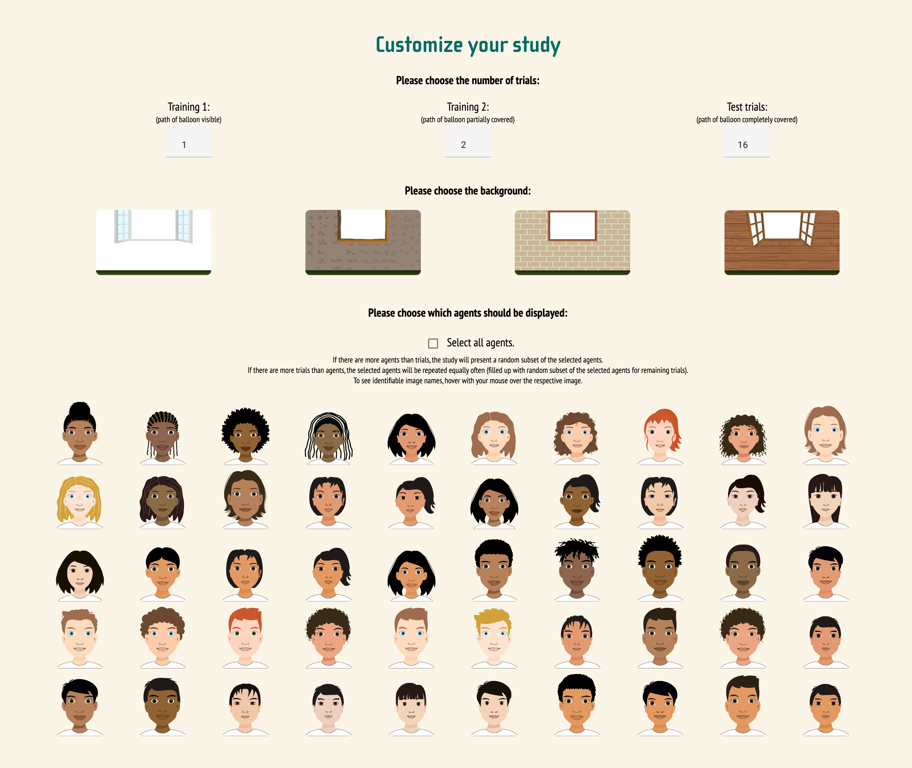

```{r setup, include = FALSE}
library("tidyverse")
library("papaja")
library("kableExtra")
library("brms")
# library("janitor")

theme_set(theme_classic())
```

```{r analysis_preferences}
# Seed for random number generation
set.seed(42)
knitr::opts_chunk$set(cache.extra = knitr::rand_seed)
```

# Introduction

For decades, researchers have advocated for more diverse samples in psychological research and cautioned against relying solely on convenience samples from the Global North [@henrich2010weirdesta; @lillard1998ethnopsychologies; @arnett2008neglecteda].
Despite numerous calls for change, the samples reported in major psychology journals still lack diversity [@gutchess2023considerationa; @thalmayer2021neglecteda; @apicella2020weird].
This hinders progress in theory building and testing: we cannot draw inferences about universal and variable aspects of the human cognitive system from data collected exclusively in one single communities [@krys2024weirda]. 
While this sampling bias is often discussed within adult psychology, it is equally relevant for developmental psychology [@nielsen2017persistent]. 
Early experiences shape the way children think about and interact with the world and an ontogenetic perspective is needed to explore the foundational aspects of human behavioral diversity [@torrens2023einfluss; @amir2020crosscultural; @broesch2023roadmap; @liebal2018crosscultural]. 

There are numerous challenges with collecting cross-cultural, developmental data [@amir2020crosscultural; @broesch2023roadmap].
Cross-cultural studies need reliable and valid measures to systematically capture variation between communities and/or individuals.
However, studies on social cognition with US-American and European samples rarely report psychometric information [for a review, see @beaudoin2020systematic], and the picture further deteriorates when we look at cross-cultural social cognition tasks [@hajduk2020how; @bourdage2023evaluation; @waschl2022crosscultural].
Thus, it is already challenging to find reliable and valid tasks that have measurement sensitivity to detect individual differences within one community, let alone tasks that do so across different communities.
In this paper, we describe the construction and psychometric evaluation of a cross-cultural measure of basic social cognition (gaze following) in children as a concrete example for how to address this problem. 

Adapting tasks to diverse communities and assessing their validity and reliability might be especially important in the social-cognitive domain.
Social cognition refers to how an individual processes information in social situations which allows them to understand and predict others' behavior [@decety2020social; @zeigler-hill2015how; @adolphs1999social; @frith2007social]. 
If, in theory, stimuli used in social cognition tasks should relate to people's everyday experiences, then tasks themselves should be tuned to the features of specific communities.
Indeed, task performance can be diminished when stimuli do not reflect characteristics of the participants' communities [@pena2007lost].
For example, @elfenbein2002universality found better emotion recognition for members of the same national, ethnic, or regional group.
@selcuk2023development concluded that children often attribute mental states more accurately and more frequently to individuals from the same community.

There exists a continuum of approaches that researchers can take to collect cross-cultural data, and the decision for a specific method partly depends on whether researchers aim to increasing the *depth* (culture specificity) or *breadth* (standardization across multiple communities) of our psychological knowledge [@amir2020crosscultural].
At one extreme, researchers translate the psychological construct into an individually designed study for each community (termed "assembly"; @he2012bias, @waschl2022crosscultural).
While this approach allows greater flexibility and sensitivity to cultural differences, it might not be feasible for studying a multitude of communities as it becomes too demanding and time-consuming.
Due to its specificity, observations are limited to each community and absolute task scores might not be comparable across communities.
A study following this approach is @wefers2023universality who investigated how cultural variations in parenting styles modulated infants' responses to disruptions in social interactions. 
While studies in the Global North often apply the Still-Face Paradigm to assess infants' reactions to unresponsive partners, @wefers2023universality reasoned that this paradigm might not capture infants' everyday interaction routines in communities with proximal (*i.e.,* emphasis on body stimulation) parenting styles. 
By developing the novel No-Touch Paradigm, they found that indeed infants' responses to unresponsive partners were modulated by the cultural context in which they grew up: Kichwa infants from rural Ecuador showed stronger reactions to unresponsive partners in the No-Touch Paradigm compared to the Still-Face Paradigm, while reactions of urban German infants differed less in both paradigms. 

At the other extreme, researchers use the same standardized procedure across diverse communities, potentially providing a simple translation or modification of stimuli to ensure they are culturally appropriate (termed "adoption" and "adaptation", respectively [@he2012bias, @waschl2022crosscultural]).
This approach is less sensitive to each community's unique characteristics but renders quantitative comparisons of data more feasible.
An example following this approach is the Multilingual Assessment Instrument for Narratives [MAIN; @gagarina2012main], which assesses narrative abilities in mono- and multilingual children. 
Extensive piloting and adaptation of MAIN materials ensured that the instrument is culturally appropriate, robust and suitable for cross-linguistic comparisons [@gagarina2012main], and new and revised language versions are continuously added to the MAIN database [@gagarina2020new].

The present paper aims to describe the development and psychometric properties of a standardized social cognition task that can be adapted to diverse communities.
Our task focuses on one of the most fundamental social-cognitive abilities: gaze following, that is, the ability to identify the attentional focus of another agent.
Gaze following develops early in infancy [@delbianco2019developmental; @tang2024slow] and contributes to social learning, communication, and collaboration [@shepherd2010following; @tomasello2007reliance; @bohn2018common; @hernik2019infant].
While the question how social-environmental and cultural factors impact gaze following was recently posed as one of the big open questions in gaze following research [@astor2022gaze], studies focusing on cultural variations of gaze following are rare.
@callaghan2011early investigated gaze following behind barriers in 12- and 17-month-olds from rural Canada (n = 35), Peru (n = 38) and India (n = 65). In their setup, an agent sat next to a wall or container and looked at a toy behind this barrier (experimental condition) or a sticker in front of it (control condition). The researchers then assessed whether and in which conditions the children crawled towards/around the barriers to follow the agent's gaze. While the absolute crawling rates differed across communities, children in all three communities crawled more often to gain visual access when the agent looked at an object behind the barrier compared to in front of it.
@hernik2019infant studied 22 infants between 5 to 7 months of age from Vanuatu and used an eye-tracking procedure displaying a local actor looking at one of two objects.
Even though face-to-face interactions are less common in interactions between caregivers and children in Vanuatu than in Western communities, the result patterns of gaze following in Ni-Vanuatu infants resembled those of their Western counterparts: infants from Vanuatu followed the agent's gaze to the target object only when preceded by infant-directed, and not adult-directed, speech.
While these two studies point towards a potential cross-cultural stability of gaze following, 
the lack of psychometrically evaluated tasks and the small number of communities studied limit the generalizability of these findings.

The task presented here aims to tackle these issues and builds upon a previously established gaze-following task called 'TANGO' (Task for Assessing iNdividual differences in Gaze understanding - Open) by @prein2023tango.
The TANGO measures how precisely participants locate an agent's attentional focus.
It reliably measured individual differences in a German child sample and an English-speaking remote adult sample [@prein2023tango].
As we cannot claim a task's generalizability and reliability based on mono-cultural samples, we need to assess the TANGO's psychometric properties in a larger cross-cultural sample. 
This paper showcases the TANGO--CC (TANGO -- Cross-Cultural), a standardized gaze following task that has been adapted to 13 languages and even more communities, and evaluates its psychometric properties by leveraging a large and diverse data set of 2.5- to 11-year-olds from 17 different communities on five continents [@bohn2024universal].
We describe the task's development and provide a tutorial for the open-source website (<https://ccp-odc.eva.mpg.de/tango-cc/>).

# Task development

## Approach

The TANGO-CC was implemented in Leipzig, Germany, and thoroughly assessed in terms of reliability and validity [@prein2023tango].
During this process, the cross-cultural adaptation of the task was prepared within a team of cross-cultural psychologists and cognitive scientists. 
In this paper, we assess the TANGO--CC's measurement quality (i.e., variability and reliability) across 17 diverse communities by analyzing the data set from @bohn2024universal.
In the following, we describe the different steps in detail.

The TANGO--CC is a screen-based task that measures the imprecision with which participants locate a balloon by following an agent’s gaze (see Figure \@ref(fig:fig1)). 
Participants click or touch the location on the screen where they believe the balloon to be.
Precision is measured as the distance between the participant’s click on the screen and the balloon’s real position.

During the task development, we decided to implement the task's main functionality independently of the task's appearance. We programmed a function that calculates the x and y coordinates of where the agent's pupil and iris should move to follow the balloon, given the eyes' and balloon's original positions and measures. As the measures of the eyes and balloon are read out dynamically from the image on screen, stimuli can be easily adapted and exchanged. No coordination values for animation are hard-coded into the task's source code. After having programmed this "backbone" functionality of the task (*i.e.*, animate the eyes so that they follow the balloon), we added the task's audio instructions and superficial appearance (e.g., background scene, hedge, more agent faces). 

This basic version of the TANGO was psychometrically evaluated in a German child sample and an English-speaking remote adult sample and was found to be highly reliable and valid [@prein2023tango].
While children became more precise in locating the attentional focus of the agent with age, individuals differed across all age groups and showed no floor- or ceiling effects.
In the Leipzig sample, performance in the TANGO was weakly related to factors of children's daily social environment and could predict children's receptive vocabulary 6 months later.
In a computational cognitive model, @prein2024variation described gaze following as form of social vector following and empirically found that performance in the TANGO was related to children's non-social vector following and visual perspective-taking abilities.
These connections to related constructs indicate the task's convergent validity in the German child sample.

To adapt the task for cross-cultural data collection, we generated a set of human cartoon faces and background scenes with the feedback from local researchers and research assistants. 
The stimulus pool was adjusted and expanded until the researchers and research assistants from each target community judged the selected stimuli to be representative of the local population and typical accommodation (see Figure \@ref(fig:fig2)).
Audio instructions were translated from English into the corresponding local language(s).
By back-translating these instructions, we ensured the original meaning did not change.
Sometimes, specific words were slightly modified in the target language (e.g., "bush" instead of "hedge") to ensure that all participants understood the instructions well. 
Based on these adaptations, the TANGO--CC could be applied in 17 communities and 13 different languages [@bohn2024universal]. In the following, we describe how researchers can use and customize the TANGO--CC in more detail.

## Features of the TANGO--CC

### Trials

(ref:figlab1) **Screenshots of the trials.** In training 1, an agent looks at a balloon that falls to the ground, and participants have to respond by clicking/touching the balloon. In training 2, the balloon falls behind the hedge while its flight is still visible. Participants respond by clicking the hedge where they think the balloon is. In test trials, the balloon's movement and final position are covered by a hedge, and participants respond by clicking the hedge. In the task, all movements are smoothly animated (no still pictures). Yellow frames indicate the time point when participants respond (only illustrative, not shown during the task). 

```{r fig1, include = T, out.width = "100%", fig.align = "center", fig.cap = "(ref:figlab1)"}
knitr::include_graphics("../figures/tango-cc-procedure.png")
```

The task consists of three different trial types: training 1, training 2, and test trials (see Figure \@ref(fig:fig1)).
In every trial, participants see an agent (boy or girl) looking out of a house with a balloon (red, blue, green, or yellow) in front of them.
The balloon falls down to the ground. The eyes of the agent follow the movement of the balloon in a way that the balloon center and the pupil center always align.
Depending on the trial type, participants have different visual access to the balloon's position.
In training 1, participants see the full trajectory of the balloon and directly have to click the balloon itself.
In training 2, participants see most of the balloon's movement, but a hedge covers the final location.
In test trials, a hedge grows at the beginning of the trial and participants see neither the movement nor the final position of the balloon.
The first trial of each type contains an audio description of the presented events (see supplements of @bohn2024universal).
Notably, the instructions explicitly state that the agent is looking at the balloon.

The outcome variable is the distance between the participant's click and the balloon's center.
Trials can be completed quickly and efficiently so that children can complete 15 trials within 10 minutes, and few children fail to complete the task.
By using self-explanatory animations, language demands are kept to a minimum.
The task uses simple audio instructions, which makes the task accessible to children from different age groups, and no reading skills are needed. 
There is no feedback during the task to prevent learning effects across trials.

### Randomization

The order of the agents, balloon colors (red, yellow, green, blue), and balloon positions are each randomized independently.
For the balloon positions, the entire width of the screen (1920 in "SVG units") is divided into ten bins.
Exact coordinates (value between 0 far left and 1920 far right) within each bin are then randomly generated.
The number of repetitions for each agent, balloon color, and balloon bin is calculated based on the total number of trials and the number of unique agents, balloon colors, and bins, respectively.
All agents, balloon colors, and bins appear equally often and are not repeated in more than two consecutive trials.
If the total number of trials is not divisible by the number of unique elements, some elements (*i.e.,* some agents, balloon colors, bins) are randomly repeated to make up for the remainder.

### Cross-cultural customization

When reseachers visit the TANGO--CC's website 
(<https://ccp-odc.eva.mpg.de/tango-cc/>), they can select the language for audio instructions which are currently available for 13 different languages and five more dialects (see Table 1). To add a new language, researchers have two options: 
(1) for using their own audio instructions in the offline version of the task, researchers can download the task, exchange the audio instructions in the dist folder (in the folder sounds > custom) and select "Custom" in the language drop down menu.
For detailed instructions, see the TANGO--CC's manual (<https://ccp-odc.eva.mpg.de/tango-cc/manual.html>). 
(2) For adding a new language in the online version of the task, researchers can contact the first author of this paper. Please note that this option requires new audio recordings by the interested reseachers, which will then be openly available for all users of the task.
All written instructions in the task are solely for the research assistant to help them guide participants through the task; these instructions are solely available in English. 
The task can either be started with the default settings or further customized by adapting the numbers of trials, agents, and background scenes.
The default settings use the version applied in @bohn2024universal based on the selected language.

If researchers choose to customize the task (see Figure \@ref(fig:fig2)), they can adjust the number of trials for each trial type, but not their sequence.
Specifically, trial types build on each other and participants need to complete each trial type (without skipping any) to understand the structure of the task. 
The minimum number of trials per type is 1; the maximum is 100. 
Furthermore, researchers can customize backgrounds by selecting one of four different backgrounds. 
Finally, researchers can choose from 50 diverse cartoon-like human faces (50% female, 50% male) and freely select how many different faces to include (min 1, max 50). 
Once all the settings are selected, the customized task is compiled. 
To save the selected settings, researchers can bookmark the URL to easily access the customized task. 

In the last step, researchers can enter an alphanumeric participant identifier (1 - 8 characters) and enable a webcam recording of the participant, if needed. A webcam recording might prove especially helpful for unsupervised online data collection to ensure that the participant is alone during the task and no help is provided.
The participant identifier and webcam choice has to be provided every time the task is run. 

The source code of the task is openly available on GitHub (<https://github.com/ccp-eva/tango-cc>). 
By directly editing the `HTML` and `JavaScript` code, researchers can further modify the task as needed. 

We created a public OSF page (https://doi.org/10.17605/OSF.IO/P2EGU) where we plan to collect data sets that used the TANGO-CC.
Researchers who have collected data using the TANGO--CC can share their data with the community by contacting the first author of this paper or visiting this OSF repository. 

```{r langtab}
lang <- tibble(
            Languages = c(
              "Bemba", 
              "Chinese",
              "English", 
              "German", 
              "(≠Akhoe) Hai||om", 
              "Khwedam",
              "Lingala",
              "Marathi",
              "Shona",
              "Spanish",
              "Kiswahili",
              "Turkish", 
              "Yaka"
            ), 
            `Language family` = c(
              "Bantu",
              "Sino-Tibetan",
              "Indo-European",
              "Indo-European",
              "Khoe-Kwadi",
              "Khoe-Kwadi",
              "Bantu",
              "Indo-European",
              "Bantu",
              "Indo-European",
              "Bantu",
              "Turkic",
              "Bantu"
            ), 
            `Speaker's country of origin` = c(
              "Zambia", 
              "China", 
              "USA / UK / India / Nigeria / New Zealand", 
              "Germany", 
              "Namibia", 
              "Namibia", 
              "Rep. Congo", 
              "India", 
              "Zimbabwe", 
              "Argentina (Rioplatense Spanish) / Mexico (Mexiquense Spanish)", 
              "Uganda", 
              "Türkiye", 
              "Rep. Congo"
            ), 
          )

apa_table(
  lang,
  caption = "Current language options available for the audio instructions in the TANGO--CC", 
  note = "In those cases where more than one speaker's country of origin is listed, the audio instructions were recorded multiple times by different speakers. For example, the English instructions are available in five different versions."
)
```

(ref:figlab2) **Customizable components of the TANGO--CC.** Researchers can select the language of the audio instructions (see Table 1), the number of trials per trial type, the background, and the agent's face. 

```{r fig2, include = T, out.width = "100%", fig.align = "center", fig.cap = "(ref:figlab2)"}

```

### Task implementation

The task was implemented in `JavaScript`, `HTML`, and `CSS` and is presented as a web app.
It can be accessed on any modern web browser on any device (e.g., computer or tablet) and does not require prior installation (please note that configurations of browsers and JavaScript may change in the future).
Participant's responses can be recorded on a touchscreen or with a mouse or track pad.
The online version of the task can be used for unsupervised data collection (for example, using online platforms like *Prolific*; see @prein2023tango). The task can be shared easily internationally by providing the URL. 
Importantly, the web app implementation does not require a working WIFI connection: An offline version of the task can be downloaded and quickly set up for devices that support Node.js (<https://nodejs.org/en>).
This is an especially useful feature for researchers working in locations with limited internet access.

The stimuli are embedded as Scalable Vector Graphics (SVG; an image format that stores image elements via mathematical formulas based on points and lines on a grid).
SVGs ensure that the picture quality, aspect ratio, and relative object positioning are constant. Furthermore, stimuli are added as individual components to the image scene which allows for an easy adaptation of task's elements (in contrast to other image formats that consist of only one combined layer that would need entire replacement).
The task is programmed so that responses are only registered when the participant clicks the relevant part of the screen (i.e., in test trials, when they click the hedge).
Furthermore, clicks are only registered after the voice recordings stop playing.
An audio reminder is played again if no click is registered within 5 seconds.

The website does not use cookies, nor does it upload any data to servers; that is, the data is only stored locally on the device.
The output of the task is a CSV file (and WEBM file if a webcam recording was selected) that contains the participants' responses and can be easily imported into statistical software for further analysis.
The file will be stored in the device's downloads folder and is named after the following pattern: "tangoCC-participantID-YYYY-MM-DD_hh_mm_ss". To modify the storage location on the device, researchers can change the designated downloads folder in the browser settings.

# Psychometric evaluation

```{r sample_table}
sample_table <- readRDS("../saves/sample_table.rds")
```

## Data set

We used the data set from @bohn2024universal for psychometric evaluation of the TANGO--CC.
The data set contains a sample of *N* = `r sample_table[sample_table$Community == "Total",]$Total` children, aged 2.5 to 11 years.
Participants came from 17 communities on five continents, in rural and urban settings, with varying degrees of market integration and technology exposure.
@bohn2024universal carried out 19 trials (1 training 1, 2 training 2, and 16 test trials, of which the first of each type had audio instructions) on a touchscreen device.
Faces, backgrounds, and languages were chosen by researchers and assistants with experience in the specific community.
For further details on the communities, participant information, and data collection procedures, see the supplements of @bohn2024universal.

## Individual differences

(ref:figlab3) **Variability measured by the TANGO--CC.** Mean imprecision in locating the agent's attentional focus by community (alphabetically) and trial type. Imprecision is defined as the distance between the participant's click and the balloon's center in units of balloon width. For a depiction of each trial's procedure, see Figure \@ref(fig:fig1).

```{r fig3, include = T, out.width = "100%", fig.align = "center", fig.cap = "(ref:figlab3)"}

```

```{r read_results}
var_df <- readRDS("../saves/var_df.rds")
within_person <- readRDS("../saves/within_person.rds")
sd_int_cor <- readRDS("../saves/sd_int_cor.rds")
descr_trialtypes <- readRDS("../saves/descr_trialtypes.rds")
int_con <- readRDS("../saves/internal_consistency.rds")
mtrialtypes <- readRDS("../saves/mtrialtypes.rds")
trialtypes_est <- readRDS("../saves/trialtypes_est")

int_con_wo_uk <- int_con %>% filter(community != "Plymouth (UK)") %>% summarise(min = min(stratified_agecorrected))
```

First, we inspected the mean and standard deviations by community and compared performance in each trial type (training 1, training 2, test trials).
Performance was defined as the absolute distance between the target center and the x coordinate of the participant's click (measured in balloon widths).
Across communities, children performed best in training 1 (mean = `r descr_trialtypes[descr_trialtypes$trialtype== "Training 1",]$mean_click`, sd = `r descr_trialtypes[descr_trialtypes$trialtype== "Training 1",]$sd_click`), followed by training 2 (mean = `r descr_trialtypes[descr_trialtypes$trialtype== "Training 2",]$mean_click`, sd = `r descr_trialtypes[descr_trialtypes$trialtype== "Training 2",]$sd_click`) and test trials (mean = `r descr_trialtypes[descr_trialtypes$trialtype== "Test",]$mean_click`, sd = `r descr_trialtypes[descr_trialtypes$trialtype== "Test",]$sd_click`; see Figure \@ref(fig:fig3)).

To formally estimate the effect of trial type on performance in the TANGO--CC, we fitted a generalized linear mixed model (GLMM) predicting the task performance by trial type (reference category: test trials).
All analyses were run in `r R.version$version.string` [@rcoreteam2024language].
GLMMs were fitted with default priors using the function `brm` from the package `brms` [@burkner2017brms; @burkner2018advanced].
The model included random effects for trial type by community (model notation in `R: imprecision ~ trialtype + (trialtype | community)`), and imprecision was modeled by a `lognormal` distribution.
We inspected the posterior distribution (mean and 95% Credible Interval (CrI)) for the trial type estimates.

Our GLMM analysis supported the visual inspection of the data: the fixed-effect estimates for training 1 ($\beta$ = `r fixef(mtrialtypes)["trialtypeTraining1", "Estimate"]`; 95% CrI [`r fixef(mtrialtypes)["trialtypeTraining1", "Q2.5"]`; `r fixef(mtrialtypes)["trialtypeTraining1", "Q97.5"]`]) and training 2 ($\beta$ = `r fixef(mtrialtypes)["trialtypeTraining2", "Estimate"]`; 95% CrI [`r fixef(mtrialtypes)["trialtypeTraining2", "Q2.5"]`; `r fixef(mtrialtypes)["trialtypeTraining2", "Q97.5"]`]) were negative and reliably different from zero. [^1]
This effect was found across all communities (random effects of trial type within community: minimum estimate for training 1 = `r max(trialtypes_est$Training1)`; 95%CrI [`r trialtypes_est$Training1_q25[which.max(trialtypes_est$Training1)]`; `r trialtypes_est$Training1_q975[which.max(trialtypes_est$Training1)]`]; minimum estimate for training 2 = `r max(trialtypes_est$Training2)`; 95%CrI [`r trialtypes_est$Training2_q25[which.max(trialtypes_est$Training2)]`; `r trialtypes_est$Training2_q975[which.max(trialtypes_est$Training2)]`]).
The almost perfect performance in training trials indicated that children understood the task and were able to correctly indicate the location of the balloon when its path was (mostly) visible.
In test trials, children's imprecision was higher, indicating that the task was more challenging.
All communities showed substantial individual variation and overlapped in their imprecision levels (see Figure \@ref(fig:fig3)).

[^1]: Please note that the TANGO--CC measures imprecision in gaze following.
Therefore, a negative sign indicates that children showed less imprecision (i.e., were more precise) in the training trials than in the test trials.

To identify the sources of variation, we computed intraclass correlations (ICC).
The variation of children's imprecision within communities was substantially larger than the variation between the communities.
The mean within-community variance was `r mean(var_df$within_community_var)`, ranging from `r min(var_df$within_community_var)` (in Pune, India) to `r max(var_df$within_community_var)` (in Chimfunshi, Zambia).
Between-community variance was `r var_df$between_community_var[1]`.
The ICC, representing the proportion of between-community variance relative to the total variance (sum of within- and between-community variance), was `r var_df$ICC_b[1]`.
This indicated that only `r var_df$ICC_b[1] * 100`% of the total variability in the data could be attributed to differences between communities, while the remaining `r (1 - var_df$ICC_b[1]) * 100`% were attributed to differences within communities [@kusano2024mismeasure].

## Reliability

(ref:figlab4) **Reliability of the TANGO--CC by community.** Internal consistency estimates by community, following three different approaches. In the odd-even split, the size of points reflects the sample size in each community. In the stratified approach with and without age correction, density curves show the posterior distributions of the GLMM.

```{r fig4, include = T, out.width = "100%", fig.align = "center", fig.cap = "(ref:figlab4)"}

```

To assess reliability, we estimated internal consistency in each community in three different ways.
First, data of each participant was split into odd and even trials and a Pearson correlation was calculated between the aggregated scores of the two halves.
Second, using the function `by_split` from the `splithalfr` package [@pronk2022methods], data was stratified by target centrality (capturing trial difficulty), and a Pearson correlation was calculated between the matched halves.
Third, a data set was generated with stratified test halves by target centrality and we applied the Generalized Linear Mixed Model (GLMM) approach introduced by @rouder2019psychometrics.
A GLMM was fitted with the mean imprecision as the outcome, age as the predictor, and test half and participant id as random effects (model notation: `imprecision ~ age + (0 + half | subjid)`).
The model estimates correlations between participant-specific estimates for each test half.
The hierarchical shrinkage of the model enables accurate person-specific estimates.
By incorporating age as a fixed effect, the correlation between the two person-specific estimates represents the age-independent estimate for internal consistency.
This removes the possibility that a good internal consistency estimate results from general cognitive development rather than task-specific inter-individual differences.
Because the process of generating stratified data sets is partly random, the model was fitted 50 times for each community.
The posterior estimate of the correlation between the two person-specific estimates was taken as the age-independent estimate for internal consistency.

The results are shown in Figure \@ref(fig:fig4). 
Across communities, internal consistency estimates ranged from `r min(int_con$odd_even)` to `r max(int_con$odd_even)` for the odd-even split, `r min(int_con$stratified)` to `r max(int_con$stratified)` for the stratified internal consistency, and `r int_con_wo_uk$min` to `r max(int_con$stratified_agecorrected)` for the age-corrected approach (Plymouth, UK, being an outlier with `r int_con$stratified_agecorrected[int_con$community == "Plymouth (UK)"]`). 
Following Cohen's suggestions [@cohen1988statistical; @cohen1992power], these correlations constitute large effects (*r* > .50), and indicate good internal consistency.[^2] 
The results are comparable to the internal consistency estimates found in the original TANGO study [@prein2023tango], and also resemble reliability estimates of classical false belief tasks [@hughes2000good]. 

[^2]: Note that for scale reliability and Cronbach's $\alpha$, values of .7 to .8 have been suggested to be acceptable [@kline1999handbook; @field2012discovering]. However, @kline1999handbook suggested that values below .7 could be realistic for psychological constructs due to their variable nature.

In an exploratory analysis, we found that communities with larger individual variation showed higher internal consistency estimates (Pearson's *r* = `r sd_int_cor$r`, 95%CI [`r sd_int_cor$lower`; `r sd_int_cor$upper`]).
This suggests that the less variation a task can capture within a community, the lower the reliability.
However, please note that this correlation could be influenced by outliers and that the sample size here (*N* = 17 communities) is too small to make substantial claims.

# Discussion

The TANGO--CC measures imprecision in gaze following across individuals, ages, and communities.
Children’s imprecision in gaze following showed highly similar result patterns across communities: children performed better in the training than the test trials, and within-community variation greatly exceeded between-community variation.
Furthermore, the task showed satisfactory to high reliability across all communities.
Therefore, the TANGO--CC is a suitable task to capture individual differences in social-cognitive development in diverse communities.

The TANGO--CC's design process lays out a much-needed pragmatic approach to studying community-level and individual-level differences across cultures: 
While we performed a detailed psychometric evaluation of the task in a German setting, we collaborated with local researchers for the cross-cultural stimulus development and selection.
Importantly, we re-assessed the TANGO--CC's psychometric properties in a large and diverse data set from @bohn2024universal, including children from 17 diverse communities in rural and urban settings with varying degrees of market integration and technology exposure.
While we cannot generalize our findings to all communities worldwide, we found that the TANGO-CC captured reliable individual variation in all communities studied by @bohn2024universal.
We hope that not just the TANGO--CC but also our pragmatic approach to constructing it will be helpful for other researchers. 
We recommend that researchers consider generalizability concerns and cross-cultural applications of their tasks and collaborate with local researchers at early stages of task development [@torrens2023einfluss]. 
Using the TANGO--CC (or any other task) in a new community requires sensitivity to the specific context, piloting, and, most importantly, the involvement of researchers or research assistants from the specific community.

@bourdage2023evaluation pointed out a major challenge with adapting social cognition tasks to diverse communities: the number of world cultures is vast, and communities are constantly changing.
Therefore, a promising approach might be to provide tasks with a modular system where components can be modified (*i.e.*, building block structure).
In the case of the TANGO--CC, the task cannot only be adapted to different languages, cartoon faces, and backgrounds (see Figure \@ref(fig:fig2)) but also updated with new stimuli.
Unlike studies that present sequential, hand-painted pictures that are difficult to adapt [@mehta2011validation], the TANGO--CC uses SVGs (Scalable Vector Graphics) that can be easily exchanged.

Compared to one of the most commonly used social cognition measure -- the change-of-location false belief task [@wimmer1983beliefs; @baron-cohen1985does] -- the TANGO--CC has several advantages: a continuous outcome measure which can capture individual differences, a short task duration that allows for more trials per child, stimuli that can be easily adapted, and known psychometric properties across 17 communities.
The task is presented as a web app that enables efficient data collection with large sample sizes, while it can also be used to collect data offline in locations without reliable internet connection.
The TANGO--CC follows a standardized procedure, which leaves no room for rater errors and greatly simplifies online training of research assistants.
Furthermore, minimal language demands and an engaging, playful design increase the task's usability and reduce non-completion rates.

The TANGO--CC is a screen-based task. 
@bohn2024universal have shown that children with no prior touchscreen exposure were less precise in the TANGO--CC than children with prior experience.
However, individual differences were also found in communities with 100% touchscreen exposure, showing that this factor alone could not explain children's performance in the task [@bohn2024universal].
Notably, even though the touchscreen experience caused absolute differences in task performance, all communities showed the same processing signature. 
A recent computational cognitive model described gaze following as a process of estimating pupil angles and the corresponding gaze vectors [@prein2024variation].
@bohn2024universal found clear support for this model in every community studied, suggesting that children all over the world process gaze in a similar way.
Nevertheless, the mode of stimulus presentation needs to be kept in mind when administering the TANGO--CC, especially in communities with little technology exposure.
Additional touchscreen training (e.g., more trials of training 1) might prove helpful in these cases.

@schilbach2013secondperson pointed out that witnessing social interactions as an observer undoubtedly differs from actively participating in social interactions.
First evidence suggests that the TANGO--CC indeed taps into social cognition as utilized in real life: @prein2024variation found that children's perspective-taking abilities in a personal social interaction was linked to performance in the TANGO, but less so to a matched, non-social vector following task. 
However, this study exclusively relied on a German sample and future research should investigate whether the relationship between the TANGO--CC and perspective-taking abilities holds across communities.

We have reported reliability estimates for each community by calculating internal consistency.
Ideally, we would have additionally evaluated the task's test-retest reliability in each community and checked for relationships with theoretically related constructs to assess validity.
Unfortunately, this might not always be feasible in large-scale cross-cultural studies due to organizational and financial constraints.
An example of assessing the TANGO's predictive validity is a study conducted in Leipzig, Germany, which used the TANGO to predict children's receptive vocabulary 6 months later [@prein2023tango].
Future cross-cultural studies could investigate the TANGO--CC's predictive validity and its relationship to other social-cognitive abilities (e.g., Theory of Mind, language development) in diverse communities. 

Measurement invariance (*i.e.*, measuring the same construct across different communities) is often seen as a requirement for a “fair” cross-cultural comparison: it is important that any group differences are not the result of the task unintentionally tapping into different underlying constructs.
As @kusano2024mismeasure put it: "The research challenge is to achieve a balance between ensuring methodological “fairness” at the individual level while also recognizing and capturing genuine sociocultural variability" (p. 34).
We argue that the TANGO--CC measures a fundamental social-cognitive ability that is likely similar across communities.
@selcuk2023development pointed out that researchers should study both within- and between-culture variability in the development of social cognition since sometimes within-culture differences exceed between-culture differences.
Indeed, we found that within-group variability was greater than between-group variability.
While we believe that the TANGO--CC can be used to compare mean differences across communities, we would recommend using it to study individual differences within communities.

For years, researchers have called for more diverse sampling and culturally valid measures of cognitive development [e.g., @mehta2011validation; @nielsen2017persistent; @matsumoto2006new].
As @hajduk2020how said, "using large samples and multisite approaches will align with efforts to improve reproducibility [replicability] and will clarify both the type and extent of cultural influences on social cognition" (p. 463).
Similarly, @elson2023psychological have called for standardized, psychometrically evaluated measures that can be re-used by other researchers in order to "build a cumulative evidence base in psychology" (p. 2). 
This underlines how efforts to improve the replicability can be combined with the goal of increasing the generalisability of psychological research [@li2024developmental; @syed2021reproducibility].
@li2024developmental have argued that replicable and generalisable results rely on stimulus sets with slight variations, more diverse samples, and data collection at a greater scale, which are all steps the TANGO--CC has taken.
Openly sharing the TANGO--CC's materials will allow other researchers to (hopefully) replicate the results and deepen our cumulative understanding of social-cognitive development across diverse communities. 

# Conclusion

The TANGO--CC captures individual differences in social-cognitive development across diverse communities.
The task’s customizability, minimal language demands, and its efficient data collection method make it a valuable tool for cross-cultural research.
The task showed satisfactory to high reliability (internal consistency) in a large data set including 17 diverse communities on five continents.
We hope that the TANGO--CC – and its pragmatic construction process – will provide a roadmap for future cross-cultural studies on cognitive development.

\newpage

# References

```{=tex}
\begingroup
\setlength{\parindent}{-0.5in}
\setlength{\leftskip}{0.5in}
```
::: {#refs custom-style="Bibliography"}
:::

```{=tex}
\endgroup
```
